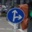
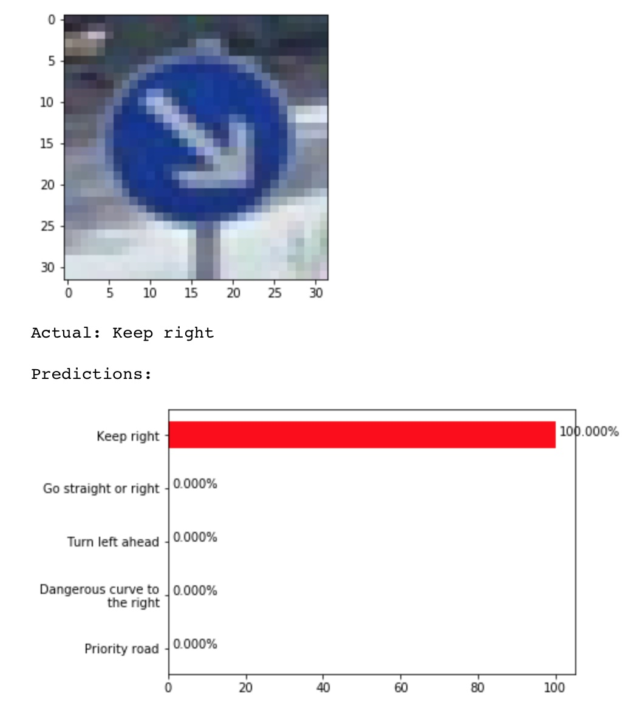

#** Traffic Sign Recognition ** 

** Udacity Self Driving Car Nanodegree - Project #2 **

Effendi Dufford
2017/7/10

## Project Goal

The goals / steps of this project are the following:

* Load a data set of German traffic sign images with classifications
* Explore, summarize and visualize the data set
* Design, train and test a model neural network architecture
* Use the model to make predictions on new images from the web
* Analyze the softmax probabilities of the new images
* Summarize the results with a written report

[//]: # (Image References)
[image1]: ./writeup_images/dataset_sign_freq.jpg "Dataset sign frequency"
[image2]: ./writeup_images/dataset_example_signs.jpg "Dataset example signs"
[image3]: ./writeup_images/preprocessing_example.jpg "Image preprocessing example"
[image4]: ./writeup_images/network_architecture.jpg "Final network architecture"
[image5]: ./writeup_images/learning_curves.jpg "Learning curves over 50 epochs"
[image6]: ./writeup_images/mispredicted_freq.jpg "Frequency of mis-predicted signs"
[image7]: ./writeup_images/top5_web01.jpg "Top 5 softmax probabilities"

## Results by Rubric Criteria

### Files Submitted

#### 1. Submission Files

My project files are located in this [github repository](https://github.com/edufford/CarND-Traffic-Sign-Classifier-Project).
The key contents are:

| File 								|     Description	        					| 
|:---------------------------------:|:---------------------------------------------:| 
| Traffic_Sign_Classifier.ipynbs 	| IPython notebook with all project code		| 
| report.html 						| Exported HTML notebook with saved results	 	|
| writeup_P2.md						| This project writeup							|
| /web_signs/websign[01~05].jpg		| Five new sign images downloaded from the web	|

The [provided sign image dataset](https://d17h27t6h515a5.cloudfront.net/topher/2017/February/5898cd6f_traffic-signs-data/traffic-signs-data.zip) was not included in the github repository due to large filesize ~160MB.

### Data Set Exploration

#### 1. Dataset Summary

After loading the data set, I used Python **len**, **set** and NumPy **.shape** to calculate basic summary statistics of the traffic signs data set:

* The size of the training set is **34,799**
* The size of the validation set is **4,410**
* The size of the test set is **12,630**
* The shape of a traffic sign image is **(32 x 32 x 3)**
* The number of unique classes/labels in the data set is **43**

#### 2. Exploratory Visualization

To visualize the dataset, I generated bar charts to show the frequency of each sign class for the training, validation, and test sets:

![alt text][image1]

The sign class numbers correspond to the following descriptions:

* 0 : Speed limit (20km/h)
* 1 : Speed limit (30km/h)
* 2 : Speed limit (50km/h)
* 3 : Speed limit (60km/h)
* 4 : Speed limit (70km/h)
* 5 : Speed limit (80km/h)
* 6 : End of speed limit (80km/h)
* 7 : Speed limit (100km/h)
* 8 : Speed limit (120km/h)
* 9 : No passing
* 10 : No passing for vehicles over 3.5 metric tons
* 11 : Right-of-way at the next intersection
* 12 : Priority road
* 13 : Yield
* 14 : Stop
* 15 : No vehicles
* 16 : Vehicles over 3.5 metric tons prohibited
* 17 : No entry
* 18 : General caution
* 19 : Dangerous curve to the left
* 20 : Dangerous curve to the right
* 21 : Double curve
* 22 : Bumpy road
* 23 : Slippery road
* 24 : Road narrows on the right
* 25 : Road work
* 26 : Traffic signals
* 27 : Pedestrians
* 28 : Children crossing
* 29 : Bicycles crossing
* 30 : Beware of ice/snow
* 31 : Wild animals crossing
* 32 : End of all speed and passing limits
* 33 : Turn right ahead
* 34 : Turn left ahead
* 35 : Ahead only
* 36 : Go straight or right
* 37 : Go straight or left
* 38 : Keep right
* 39 : Keep left
* 40 : Roundabout mandatory
* 41 : End of no passing
* 42 : End of no passing by vehicles over 3.5 metric tons

The distributions show that some signs such as "0: Speed limit (20km/h)" and "19: Dangerous curve to the left" have much lower frequency than others such as "2: Speed limit (50km/h)", which could lead to the model learning an uneven bias in its predictions.

However, **the relative frequencies are similar overall between training, validation, and test set so this may indicate that these low frequency signs are actually rare to find on actual roads**.  Because of this, I decided not to try to artificially balance the dataset and should be able to get similar prediction accuracy among the sets.

Looking at some randomly selected images from each sign class shows significant variation in image brightness, clarity, and even color:

![alt text][image2]

Some image preprocessing should help to reduce these variations.

### Design and Test a Model Architecture

#### 1. Preprocessing

I used simple 2-step preprocessing for all images fed to the model.

The **1st preprocessing step is histogram equalization** to reduce variation in the brightness/contrast.  To do this, I chose to use [Contrast Limited Adaptive Histogram Equalization (CLAHE)](http://docs.opencv.org/3.1.0/d5/daf/tutorial_py_histogram_equalization.html) on the Lightness and Saturation channels of each image converted from RGB->HLS colorspaces.  The Hue color channel is left unmodified.  This was able to improve the visibility of the signs evenly while also keeping the color information in case it may be useful for the model to learn, since that is how humans interpret signs.

The **2nd preprocessing step is simple normalization** on the RGB values to linearly rescale them from a range of [0,255] to [-0.5,0.5].  The normalized images display with strange colors because of the way matplotlib's **imshow** deals with the negative float values, but the raw normalized values should have **equal variance** and **zero mean** to be well conditioned for the model's weights and biases to learn.

![alt text][image3]

#### 2. Model Architecture

My final model consisted of the following architecture:

![alt text][image4]

| Layer         										|     Description	        					| 
|:-------------------------------------------------:|:---------------------------------------------:| 
| Input         										| 32x32x3 RGB image   							| 
| CNN1:  Convolution 5x5 + RELU							| 1x1 stride, valid padding, outputs 28x28x16 	|
| POOL1: Max pooling	      							| 2x2 stride,  outputs 14x14x16 				|
| CNN2:  Convolution 5x5 + RELU							| 1x1 stride, valid padding, outputs 10x10x32	|
| POOL2: Max pooling	      							| 2x2 stride,  outputs 5x5x32	 				|
| FCL1:  Fully connected, Multi-Scale from POOL1 + RELU	| Flat input 3936, outputs 1024 				|
| Dropout												| 50% keep probability							|
| FCL2:  Fully connected + RELU							| Input 1024, outputs 1024						|
| Dropout												| 50% keep probability							|
| FCL3:  Fully connected + RELU							| Input 1024, outputs 43 sign classes			|
| Softmax												| Converts raw 43 class logits to probabilities	|
 

This architecture started based on LeNet-5, but I **expanded the convolution feature depths** since LeNet was based on only 10 numerical digit classes and this network needs to be able to learn more features from the 43 sign classes, such as various sign external shapes and internal symbols.

I added a **Multi-Scale connection** from the output of POOL1 to allow the fully connected layers to directly use the higher level features detected by the first convolution layer, following the strategy from the Sermanet/LeCun paper "Traffic Sign Recognition with Multi-Scale Convolutional Networks".

I also added **Dropout** on the two internal fully connected layers to try to reduce overfitting from the expanded network dimensions.  The fully connected layer size of 1024 was chosen based on covering the complete pixel size of the original images (32*32=1024).

Before choosing this final architecture, I also ran various experiments trying other things but did not get any significant accuracy improvements.  For example, I tried simplifying to a single fully connected layer, but the network underfit so the training set accuracy could not get close to 100%.  I tried more convolution layers of various patch sizes and depths, and also included more multi-scale connections, but the network size grew large so training time became very long and the accuracy did not really improve.

Here is what I learned about neural network architecture from this experience:

> My approach to choosing a neural network architecture is to start as simple and flat as possible (ex. 1 or 2 CNN's, 1 fully connected layer) so that the training data is initially underfit and training/evaluation iterations are quick, and then start expanding it step-by-step until training accuracy approaches 100%.

> Adjusting convolution feature depths and sizes can encourage the network to pick up the right key image features (ex. sign edge shapes, internal symbols, numbers, etc).

> Increasing the number of fully connected layers and their sizes can allow the model to increase training data accuracy but will start to overfit.

> Adding Dropout or L2 Regularization can help reduce overfitting when training accuracy hits 100% to try to keep improving validation accuracy and generalize the model predictions.

#### 3. Model Training

To train the model, the Adam optimizer was used with **batch size of 256** for **50 epochs**.  The validation accuracy stopped improving after about 25 epochs.  I also used **learning rate decay** to prevent accuracy oscillations, starting from a **learning rate of 0.001** and exponentially decreasing to ~0.0001 after 40 epochs.

I also experimented with using batch sizes of 128 and 512, but there was no significant difference to the result.

![alt text][image5]

#### 4. Solution Approach

My final model results were:

* Training set accuracy of 99.215%, indicating good learning without too much overfitting
* Validation set accuracy of **95.624%**
* Test set accuracy of **95.637%**

The 5% accuracy gap between training and validation/test sets seems to indicate that the model is **not generalizing enough** to cover some feature differences between the data sets.  Changing the model architecture did not seem to improve this much, but further improvement may be possible by increasing the amount of training data or using **augmentation** to artificially expand the training data set to close this gap.

We can check the **distribution of mis-predicted signs** to see if there are any outliers.  In the bar graphs below, we can see that sign class #39, "Keep left", is the most mis-predicted sign and this class is also one of the low frequency signs in the training data set.  Balancing or augmenting the training data could help train the model to be more accurate for these kinds of classes.

![alt text][image6]

### Test a Model on New Images

#### 1. Acquiring New Images

Here are five German traffic signs that I found on the web via Google Maps:

    

These images **should not be difficult** for the model to predict because they are all clear with no occlusions or discolorations.  Many of the training images looked much more difficult to distinguish than these.

These signs also represent a variety of **shapes** (round, diamond, triangle), **colors** (blue+white, red+white+black, white+yellow), and **internal symbols** (arrows, person, numbers, no symbol) to try to cover the model's feature recognition capabilities.

#### 2. Performance on New Images

Here are the results of the predictions:

| Image			      		|     Prediction	        					| 
|:-------------------------:|:---------------------------------------------:| 
| Keep right      			| Keep right   									| 
| Road work   				| Road work 									|
| Priority road				| Priority road									|
| **Go straight or right**  | **Turn right ahead**			 				|
| Speed limit (30 km/h)		| Speed limit (30 km/h)  						|

The model was able to correctly guess 4 of the 5 traffic signs, which gives an **accuracy of 80%**.  This is lower than expected when compared to the 95% validation and test accuracy and considering the good clarity of the web images.

From this experience I realized:
>Even if a neural network seems to have very high accuracy from a validation and test set of data, there is **still a significant chance that it may mis-predict** a new image and be completely wrong sometimes.

>These neural networks **can only match things as well as the data that they were fed** during training and are **not necessarily capturing the general understanding of the image features like humans do**.  Training on more and more data may help reduce this, but may not really guarantee robustness.

>Safeguards and redundancies need to be applied to any control system that relies on neural networks to prevent these mis-predictions from throwing off the system.

#### 3. Model Certainty - Softmax Probabilities

Checking the top 5 softmax probabilities can show more about how confident these predictions were and what other classes were considered as possibilities, especially for the mis-predicted "Go straight or right" sign.

---

The model had 100% confidence that this was a "Keep right" sign and was correct.

---

The model had 100% confidence that this was a "Road work" sign and was correct.

---

The model had 100% confidence that this was a "Priority road" sign and was correct.

---

The model mis-predicted that this was a "Turn right ahead" sign, but was only 36% confident.  The next highest prediction was "Go straight or right" with 26% confidence, so the model was almost correct.

The "Turn right ahead" class #33 is ~2x more frequent than the "Go straight or right" class #36 in the data sets, so this may have been biased by the unbalanced data set.  However, it would be better if the model could distinguish the differences in the arrow symbols more clearly despite this bias to have a stronger confidence and make the right prediction.

---

The model had 100% confidence that this was a "Speed limit (30 km/h)" sign and was correct.

---

### Visualizing the Neural Network

Running the web images through the network to visualize the convolution layer activation outputs can provide further insight into what features the model is picking up on to use for the predictions, especially for the mis-predicted "Go straight or right" sign.

Generally, the 1st convolution layer seems to pick up multiple instances of key features such as the sign's external shape edges, the base color area, and parts of the internal symbols, but these features are mixed and intertwined in each feature map.

However, the 2nd convolution layer seems much more abstract since it has already been downsampled by max pooling to such a small patch size.  It's not clear if this part of the architecture was effective or not.

---

---

---

---

Considering the mis-predicted "Go straight or right" sign, it's interesting that the 1st convolution layer seems to have picked up the "go straight or right" arrow symbol correctly, such as in FeatureMap 9 and 11, but still ended up mis-predicting it as a "Turn right ahead" sign.

The features in the 2nd convolution layer are not clear and maybe did not provide good enough additional detail to pick out the small differences in these internal symbols like a "turn right" arrow vs a "go straight or right" arrow.

---

---
